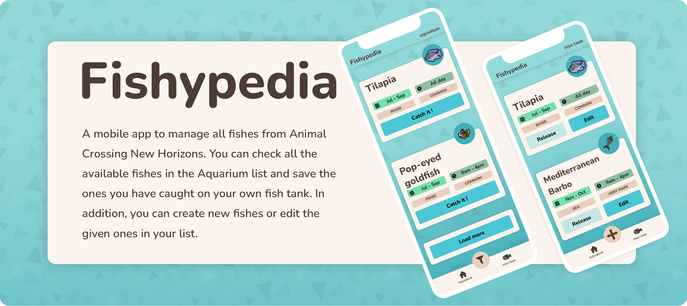

 

## 💻 Members of the team

 

<table align="center" width=100%>
    <tbody>
        <tr>
            <td>
              

                <a href="https://github.com/BorisMichaelRandebrock" alt="BorisMichaelRandebrock's profile">
                  🔗 Boris Randebrock
                   
                  
                </a>
              

            </td>
            <td>
              

                <a href="https://github.com/NachoLosada"        alt="NachoLosada's profile">
                  🔗 Nacho Losada
                   
                  
                </a>
              

            </td>
            <td>
              

                <a href="https://github.com/MariamLliso" alt="MariamLliso's profile">
                  🔗 Mariam Lliso
                   
                  
                </a>
              

            </td>
        </tr>
    </tbody>
</table>

 

## 🛠 Technologies

 

`Developed with`

 

`Tools we used`

   

`Testing`

 

This project was made as a part of the <a href="https://isdicoders.com/" alt="ISDI Coders's website">ISDI Coders</a> bootcamp team projects week. 

